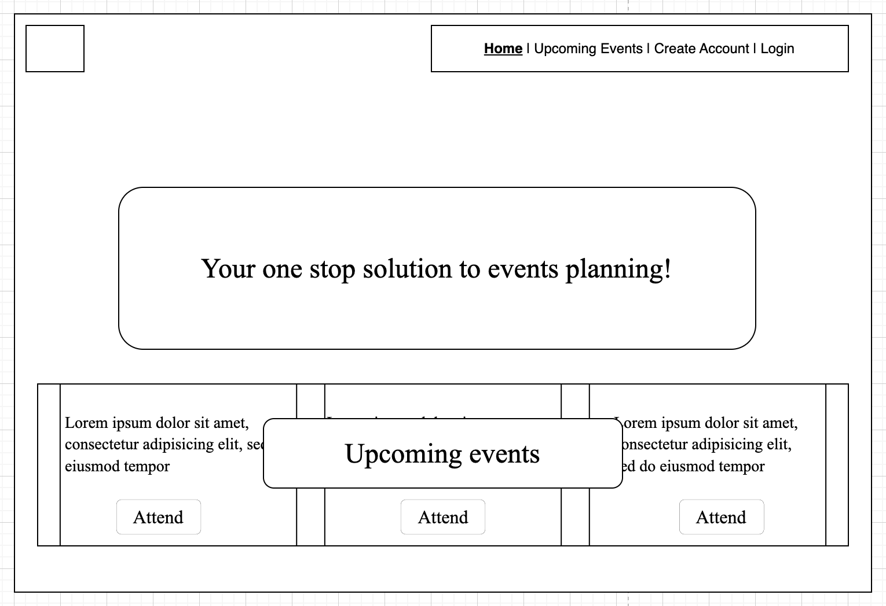
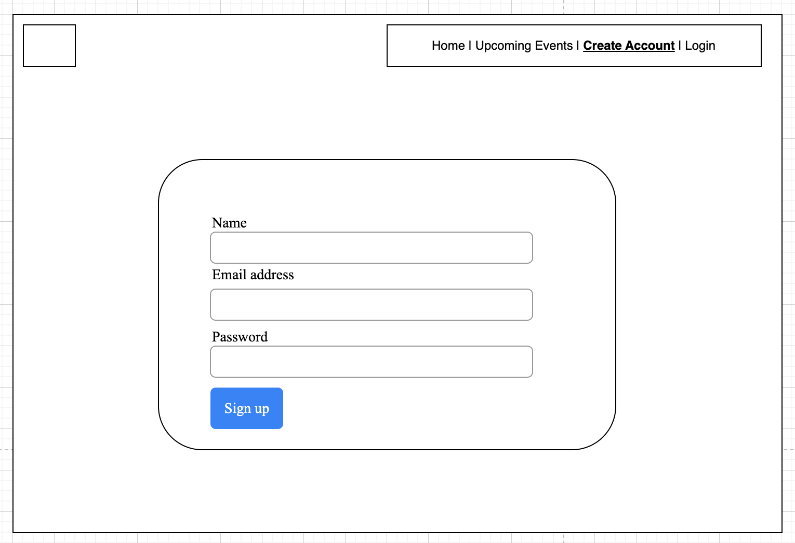
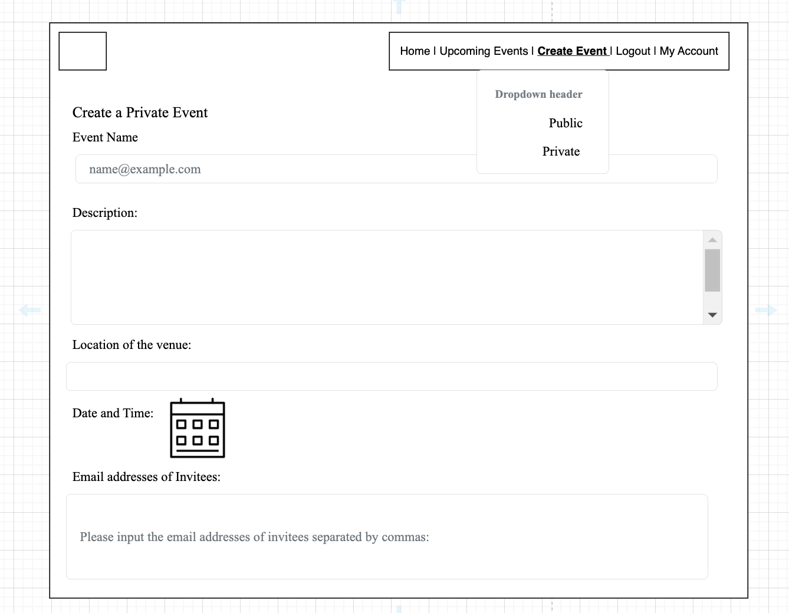
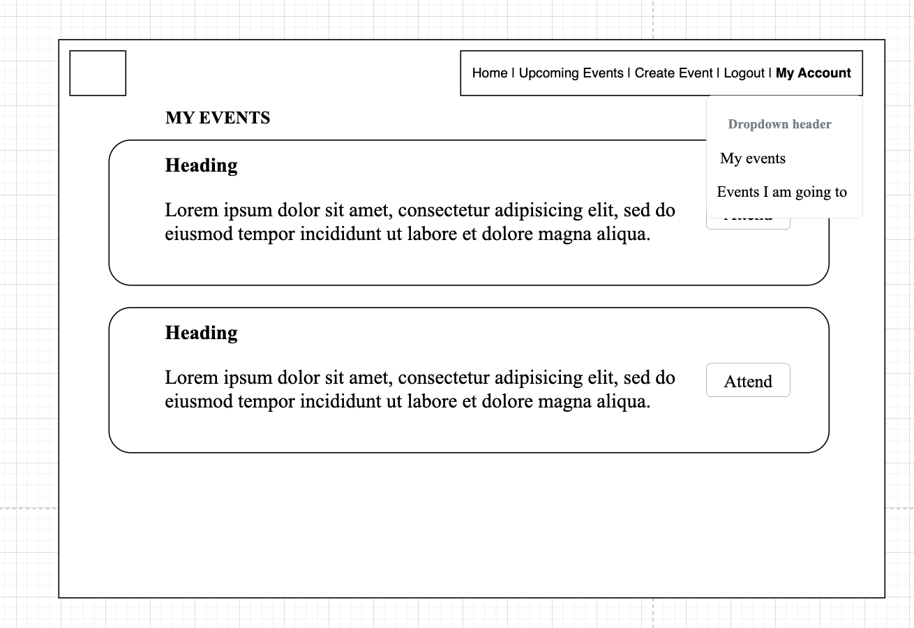
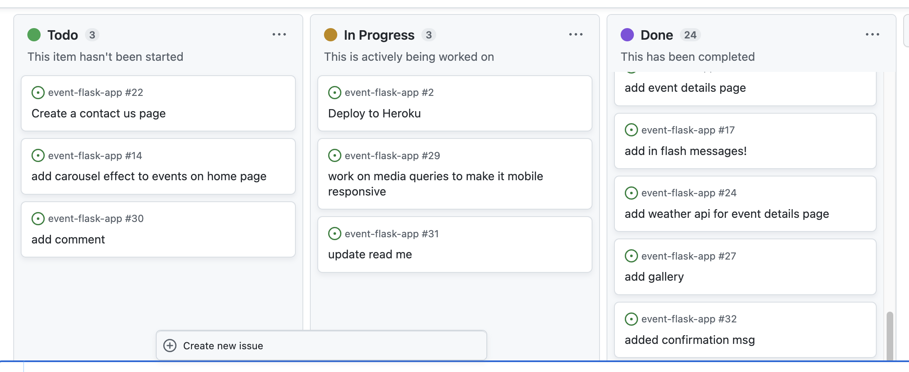

# event-flask-app
### A full stack database-backed application based on event planning.

This app is designed to help create electronic invites to make people's life easier. Users are able to design events that suits their needs.
Public events are created which can be accessed by all, while private events are only accessed by the user and the invitees.

I started the project approach through a lengthy planning process where I used Draw.io to sketch out some wireframes for the app and used git's project section to keep track of my work process.

## Project Description:

1. The app is based on 4 tables: users, events, images and attendance.
1. Each email address is limited to 1 account and the password has to be verified in 2 steps during signing up for better user experience.
2. Incorrect values for email or password are tackled with flash msges
1. The landing page will appear different depending on whether you are logged in or not. Either way, there will be a display or upcoming public events near the bottom of the page.
1. Upcoming events section shows all public events and all private events to which the user is invited to or the user has created.The user can choose to attend or cancel attendance to the events he didnt create, which will appear in his 'attending events' section. There is also a searchbar funcitonality to look up particular events by name.
1. The event details section holds the gallery, edit or delete functionality of the event and add photos functionality to the gallery with the help of cloudinary. I have added a weather API (open-meto) and Nominatim (for geocoding) to check weather if the date is within 15 days.

1. When creating the event, the user can choose to send email invites to invitees for private events using SMTPlib
 
1. Host can perform full CRUD functionalities with Creating, Reading, Updating  and Deleting events. 

1. The user can choose to delete his account as well. On any deletion, there will be a confirmation prompt to avoid mistakes.

### Difficulties:
Mainting table and their connections can be a bit tricky. I struggled a bit with building those connections.

## Favourite Part:
Same as the difficutly. I felt accomplished and motivated when i could solve those issues.

## Add next:
I didnt get chance to work on media queries. would like to add those features. Also, I would like to add a comment secion to the event details page, where invitees can post comments.

References: weschool for dropdown and search bar
